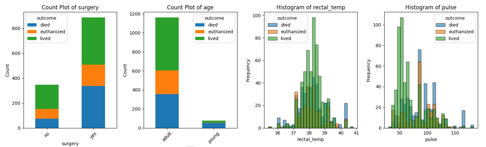
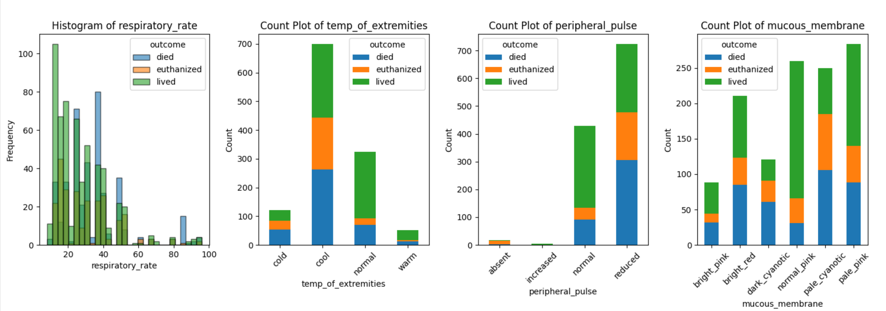
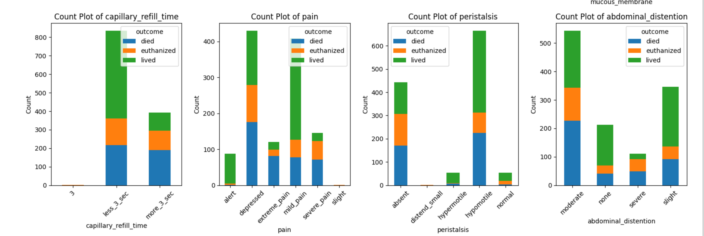
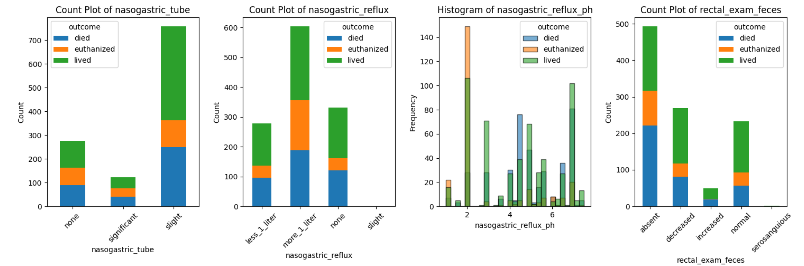
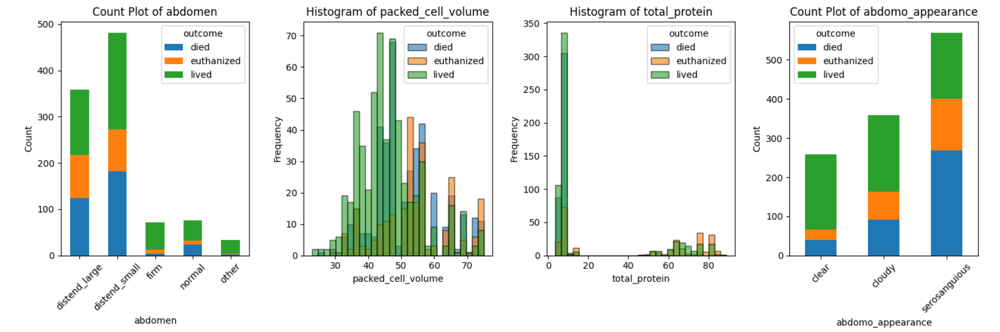
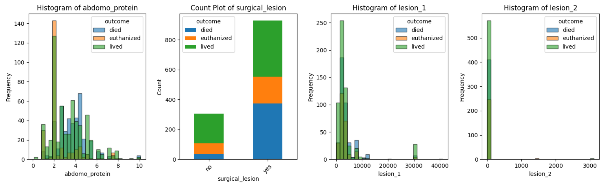
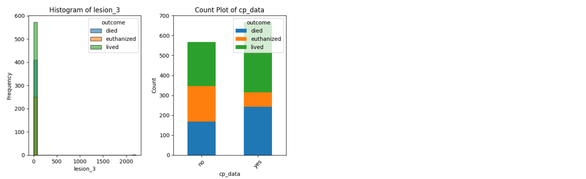

# Predict Heath Outcomes of Horses

This repository holds an attempt to train a model using machine learning that applies prediction outcome algorithms to determine whether a horse lived, died, or euthanized. Kaggle challenge: https://www.kaggle.com/competitions/playground-series-s3e22/overview 

## Overview

The task, as defined by the Kaggle challenge is to use the given various medical indicators to predict the health outcomes of horses.The approach in this repository formulates the problem as a multi binary classification task, using different classification methods of machine learning like Linear Regression and Random Forest. The performance of each was compared between the different methods. The best model, linear regression, was able to predict the health outcome with a 68.41% accuracy.

### Data

* Data:
 * Train.csv consisted of 1235 rows and 29 columns.
 * Test.csv consisted of 824 rows and 28 columns.
    * Input: horse health, CSV file: filename -> train.csv
    * Output: lived/died/euthanized within outcome variable.
  * Instances (Train, Test, Validation Split): 
     * Training Set: 70% of the total data
         * Features: 864 samples, 10 columns
         * Targets: 864 samples, 3 classes
      * Test Set: 15% of the total data
         * Features: 186 samples, 10 columns
         * Targets: 186 samples, 3 classes
      * Validation Set: 15% of the total data
         * Features: 185 samples, 10 columns
         * Targets: 185 samples, 3 classes

#### Preprocessing / Clean up

* Identified any missing and/or duplicate variables.
   * Numerical Columns: Impute missing values with the median.
   * Categorical Columns: Impute missing values with the most frequent value (mode) or use a placeholder like 'Unknown'.
* One-hot encoding used to convert categorical variables to numerical, for better machine learning.
* Standard Scaler:
   * For Features: rectal_temp, pulse, respiratory_rate, packed_cell_volume, total_protein, abdomo_protein.
   * This was used to make the range more reasonable and to normalize the data.
* Used Min-Max scaling:
   * Since the numerical features in the dataset have unknown distributions, Min-Max scaling provides a consistent range.
   * Also, brings all features into the same range (0 to 1), ensuring that no feature dominates the learning process due to larger scales.

#### Data Visualization

Shown is the outcomes (lived, died, and euthanized) for each variable in the data set.
 
 
 
 
 
 
 

### Problem Formulation

* Define:
  * Models
    * Linear Regression:
       * Logistic Regression was used because it is a simple yet powerful baseline model for classification tasks and the One-vs-Rest strategy ensured effective multiclass classification.
    * Random Forest:
       * Random Forest can handle complex, non-linear relationships in the data and provides feature importance insights and is robust to outliers and missing values.

### Training

Training was difficult with the outcome column because it consisted of lived, died, and euthanized. I had to seperate them into their own columns, so that they could be assesed using the models. 

### Performance Comparison

Overall Accuracy:
* RandomForestClassifier:
   * Validation accuracy of 65.41%.
   * Higher recall on "died" class but lower precision for "euthanized."
* LogisticRegression:
   * Validation accuracy of 68.11%.
   * Balanced performance across all classes.
 
Class-Level Performance:
* "Died" Class:
   * Random Forest: Recall of 77% but lower precision at 60%.
   * Logistic Regression: Better balance with 75% recall and 67% precision.
* "Euthanized" Class:
   * (Both models struggled with "Euthanized" due to class imbalance.)
   * Random Forest: Recall of 47% and precision of 64%.
   * Logistic Regression: Similar recall (47%) but lower precision (64% vs. 55%).
* "Lived" Class:
   * Random Forest: Recall of 65% and precision of 71%.
   * Logistic Regression: Higher recall at 76% and precision at 74%.

### Conclusions

Logistic Regression outperformed Random Forest in this dataset, achieving better overall accuracy and balanced performance across classes. Random Forest was useful for understanding feature importance and handling non-linear relationships, however, struggled due to class imbalance and did not generalize as well as Logistic Regression. Further improvements could be made through hyperparameter tuning, cross-validation, or using ensemble methods.

### Future Work

* What would be the next thing that you would try.
* What are some other studies that can be done starting from here.

## How to reproduce results

* To fully reproduce my results:
   * Download the datasets from Kaggle (and any other info needed).
   * Ensure the necessary libraries are installed (can use different ones if applicable).
   * Download the Kaggle_Project notebook attached in the directory and run it.
Useful Resources:
Sklearn website; the sklearn website is a great place to find detailed explainations of the models and tools used in this project.

### Overview of files in repository

* Directory Structure: the directory contains a README.md, the code for my Kaggle project, and image files for my visuals.
Relevent Files:
* KaggleProject.ipynb: this notebook contains all of the code for the final submission of my Kaggle project.

### Software Setup
* Required Packages:
   * Numpy
   * Pandas
   * Sklearn
* Installation Process: (All packages were installed via the Linux subsystem for Windows.)
   * pip install numpy
   * pip install pandas
   * pip install scikit-learn

### Data

* Data can be downloaded from: https://www.kaggle.com/competitions/playground-series-s3e22/data 
   * Select the train and test data for this project

### Training

* Modles were trained using scikit-learn.
* By running the KaggleProject file, you can see how the data set was trained.

#### Performance Evaluation

* Describe how to run the performance evaluation.

